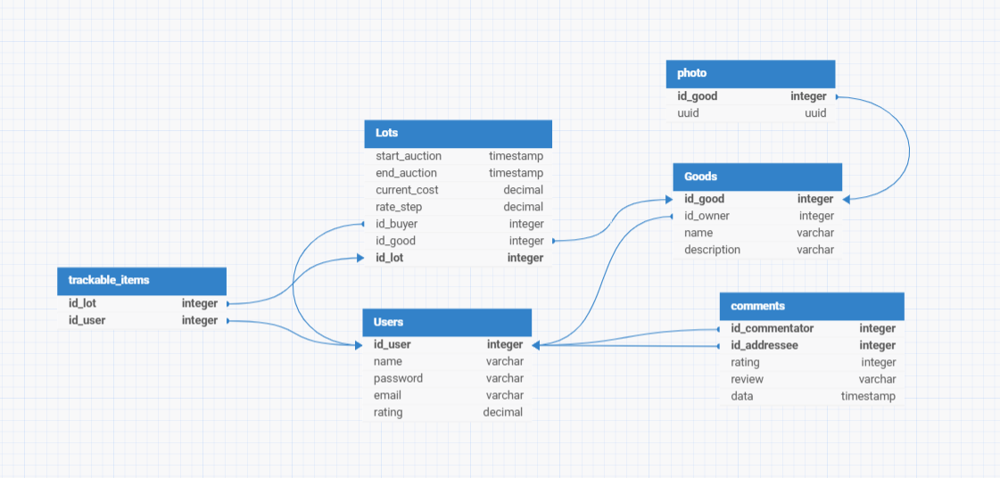

# Онлайн Аукцион различных товаров.
# Описание и данные
Сервис предоставляет возможность размещения лотов, которые могут преобрести другое пользователь сервиса. Для удобства пользовалей
существует функция отслеживания товара. Также можно оставлять отзыв пользователям после успешной покупки.
Предметная область состоит из пользователей их лотов и комментариев. 
Информация о лотах разбита на 3 таблички Lots, Goods и photo.
В таблице Lots включает в себя такие атрибуты как: начала,
конец аукциона, текущая стоимость лота, шаг для повышения цены, id покупателя, id продавца, id лота.
Следует учитывать, что завершение происходит после начала, цена лота не может измениться меньше чем установленный положительный шаг,
не может подешеветь, у лота обязательно должен быть владелец, иначе лот следует закрыть и удалить товар.
В таблице Goods находится информация о названии и описания товара, id товара и id владельца товара. Также должен существовать
владелец, иначе товар следует удалить.
В photo хранятся uuid фотограий и id_товара принадлежащие ему. Если товар не находится в системе - фотографии сделует удалить.
Пользователи храняться в отдельной таблице с атрибутами id пользователя, имя пользователя,
не пустая, без уникальных символов и цифр строчка, не более 32 символов, пароль хранящий hash пароля,
валидная почта форматы user@domain.com, оценка пользователя,число считаеться от среднего значения оценок коментариев.
Комментарии храняться в отдельной таблице с атрибутами id коментатора, id адресанта, оценка комментария, текст комментария
и дата создания. У комментария фиксированный размер, превысить который нельзя. Обязательно должены быть id коментатора и адресанта.
Оценка целое число от 0 до 5 включительно.
Также, для того чтобы пользователь могли отслеживать лоты, существует таблица trackable_item, где находятся два атрибута id лота 
и пользователя. Оба id должны быть с системе.

# Пользовательские роли
Продавец и покупатель. Пользователь может быть как продавцом, так и покупателем. 
Продавец размещает товар, дает ему характеристику и название, после выставляет на аукцион, определяя начальную цену, шаг ставки и дату окончания торгов. 
Покупатель может просматривать товары, участвовать в торгах, а также, если побеждает в тограх, то и в покупке.
# UI
Планируется написать сайт для возможность пользоваться сервисом
# Технологи разработки 
## Фронтенд
TS, CSS, HTML
## Бекенд
Java
## База Данных
PostgreSQL
#Тестирование
Java: JdbcTemplate (Spring Framework), JUnit
