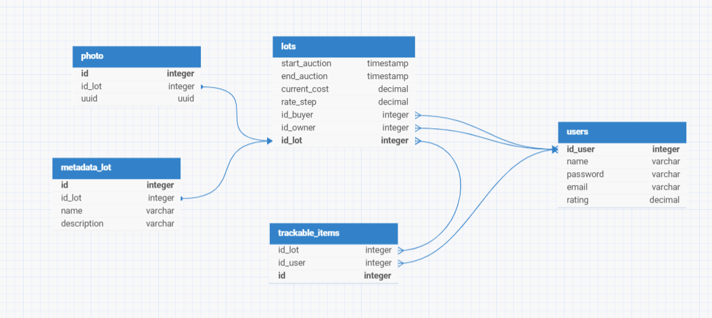

# Онлайн Аукцион различных товаров.
# Описание и данные
Сервис предоставляет возможность размещения лотов, которые могут приобрести другое пользователь сервиса. Для удобства пользователей
существует функция отслеживания товара.
# Предметная область
Предметная область состоит из пользователей их лотов и комментариев. 
Информация о лотах разбита на 3 таблички lots, metadata_lot и photo.

В таблице lots включает в себя такие атрибуты как: начала,
конец аукциона, текущая стоимость лота, шаг для повышения цены, id покупателя, id продавца, id лота.
Следует учитывать, что завершение происходит после начала, цена лота не может измениться меньше чем установленный положительный шаг,
не может подешеветь, у лота обязательно должен быть владелец.

В таблице metadata_lot находится информация о названии и описания товара.

В photo хранятся uuid фотографий и id_товара принадлежащие ему. Если товар не находится в системе - фотографии следует удалить.
Пользователи хранятся в отдельной таблице с атрибутами id пользователя, имя пользователя не более 32 символов, пароль хранящий hash пароля,
валидная почта форматы user@domain.com

Также, для того чтобы пользователь могли отслеживать лоты, существует таблица trackable_item, где находятся два атрибута id лота 
и пользователя. Оба id должны быть с системе.

# Пользовательские роли
Продавец и покупатель. Пользователь может быть как продавцом, так и покупателем. 
Продавец размещает товар, дает ему характеристику и название, после выставляет на аукцион, определяя начальную цену, шаг ставки и дату окончания торгов. 
Покупатель может просматривать товары, участвовать в торгах, а также, если побеждает в торгах, то и в покупке.
# UI
Есть сайт написанный на React. Что увидеть лоты нужно авторизоваться, для этого есть страницы регистрации и входа. Далее вас встречает главная страница, где вы можете увидеть все лоты пользователей. Во вкладке создать лот вы можете создать лот. Чтобы создать лот нужно написать его название, описание, начальную цену, шаг ставки, дату начала и конца аукциона. Далее вы можете увидеть его во вкладке профиль, где также будет видна информация о вашем аккаунте. Также для удобства, есть отдельная вкладка с отслеживаемыми товарами. Что бы участвовать в торгах необходимо нажать на лот. После откроется отдельная вкладка в браузере где вы можете увидеть всю информацию о лоте и поставить свою цену. 
# Технологи разработки 
## Фронтенд
React, TS, CSS, HTML
## Бекенд
Java Spring Boot, Maven
## База Данных
PostgreSQL, JPA
# Тестирование
Ручное
