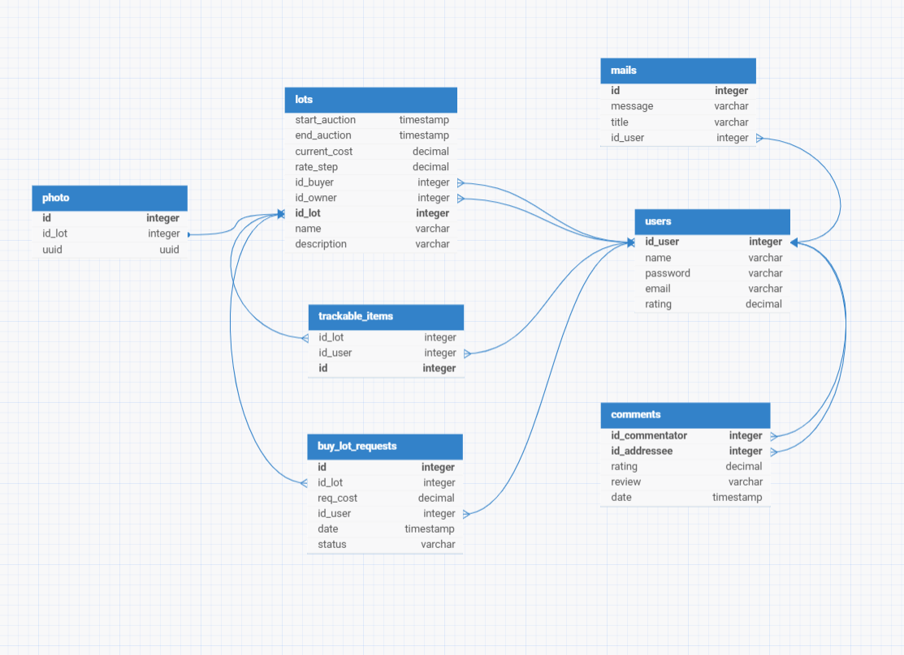

# Онлайн Аукцион различных товаров.
# Описание и данные
Сервис предоставляет возможность размещения лотов, которые могут приобрести другое пользователь сервиса. Пользователи могут отметить лот, чтобы его отслеживать, еще могут написать комментрарий о другом пользователе после покупки. Также внутри сервиса есть почта, на которой будут размещаться письма уведомлений.
# Предметная область
Предметная область состоит из пользователей, их лотов, комментариев и писем. 

Всего в базе данной находится 7 таблиц:
### 1. lots

Хранит информацию о лоте, а именно: начало и конец аукциона, текущую цену, шаг ставки, id покупателся и продавца, id, имя, описание лота.
### 2. photo 

Хранит UUID фотограции принадлежащего лоту, который можно определить по id
### 3. users

Хранит информацию о пользователях сервиса: id, имя, пароль, email пользователя. Пароль хешируется при помощи встроеного в Spring Security метода.
### 4. trackable_items

Хранит информацию о том какой пользователь отслеживает какой лот. 
### 5. buy_lot_requests

Хранит иформацию о запросах обновления цены лота.
### 6. mails

Сохраняет уведомления для каждого пользователя.
### 7. comments

Содержит комментарии пользователей.

# Пользовательские роли
Продавец и покупатель. Пользователь может быть как продавцом, так и покупателем. 
Продавец размещает товар, дает ему характеристику и название, после выставляет на аукцион, определяя начальную цену, шаг ставки и дату окончания торгов. 
Покупатель может просматривать товары, участвовать в торгах, а также, если побеждает в торгах, то и в покупке.
# UI
Есть сайт написанный на React. Что увидеть лоты нужно авторизоваться, для этого есть страницы регистрации и входа. Далее вас встречает главная страница, где вы можете увидеть все лоты пользователей. Во вкладке создать лот вы можете создать лот. Чтобы создать лот нужно написать его название, описание, начальную цену, шаг ставки, дату начала и конца аукциона. Далее вы можете увидеть его во вкладке профиль, где также будет видна информация о вашем аккаунте. Также для удобства, есть отдельная вкладка с отслеживаемыми товарами. Что бы участвовать в торгах необходимо нажать на лот. После откроется отдельная вкладка в браузере где вы можете увидеть всю информацию о лоте и поставить свою цену.
# Тесты

В проекте настроены модульные и интеграционные тесты для основных слоёв приложения: веб‑слоя (REST‑контроллеры) и сервисного слоя.

Контроллеры

В пакете src/test/java/com/project/auction/controller находятся тесты HTTP‑эндпоинтов приложения.
AuthControllerTest – проверяет аутентификацию и авторизацию (логин, регистрация, работа с JWT‑токенами).
LotControllerTest – тестирует операции с лотами: создание, просмотр, изменение статуса и т.д.
CommentControllerTest – проверяет создание и получение комментариев к лотам.
ImageControllerTest – тестирует загрузку и получение изображений.
ProfileControllerTest – проверяет операции с пользовательским профилем.
TrackableItemControllerTest – тестирует работу с отслеживаемыми объектами.
JwtTestControllerTest – дополнительные проверки инфраструктуры JWT (валидация, обработка ошибок и т.п.).

Тесты контроллеров используют имитацию HTTP‑запросов для проверки корректности кодов ответа и структуры возвращаемых данных.

Сервисы

В пакете src/test/java/com/project/auction/service расположены тесты бизнес‑логики.
AuctionSchedulerTest – проверяет планировщик задач аукциона (например, автоматическое завершение лотов).
LotServiceTest – тестирует операции с лотами на уровне сервиса.
ImageServiceTest – проверяет логику работы с изображениями.
TrackableItemServiceTest – тестирует логику обработки отслеживаемых объектов.
UserDetailsServiceTest и UserDetailsServiceImplTest – проверяют загрузку и обработку данных пользователей, используемых подсистемой безопасности.

Для этих тестов используются mokito для пороверки логики​

Тест запуска приложения
AuctionApplicationTests – этот тест проверяет, что Spring Boot‑приложение вообще может подняться и что контекст создаётся без ошибок.​

Запуск тестов
Перед тем как начать тестирование надо перейти в папку server:
```
cd server
```
Все тесты запускаются стандартной Maven‑командой
```
mvn test
```
или вместе со сборкой проекта:
```
mvn clean test
```
# Как запустить?
## frontend
Скачайте [node.js](https://nodejs.org/en)
Перейдите в папку frontend, загрузите необходимые зависимости и запустите сайт. 
```
cd frontend
npm install
npm start
```
Скорее всего, из-за самоподписного серфитиката, ваш браузер будет отклонять https запросы с самоподписным серфитикатом, вам придется разрешить браузеру обращаться как на https://localhost:3000, так и на https://localhost:8443. Уведомление обращения на https://localhost:3000 появиться сразу при запуске сайта, а на https://localhost:8443 вам нужно будет открыть ссылку и проделать тоже самое что и с первой ссылкой.
## backend
Скачайте [Java 17](https://adoptium.net/)
```
cd server
mvn spring-boot:run
```
все необходимы зависимости скачаются сами.

## data base
Для того чтобы развернуть базу данных, есть [Схема БД](auction_db_scheme.sql), где находится SQL запрос на создание таблиц и связей между ними.
В [application.properties](server/src/main/resources/application.properties) необходимо будет изменить поля под ваши характеристики.
```
spring.datasource.url=jdbc:postgresql://localhost:5432/db_name # 
spring.datasource.username=db_username
spring.datasource.password=db_password
```
## Keystore.p12 (HTTPS)
если планируете менять:
1. Удалите старый
```
rm server/src/main/resources/keystore.p12
```
2. Создайте свой
```
keytool -genkeypair -alias ALIAS -keyalg RSA -keystore src/main/resources/keystore.p12 -storetype PKCS12 -dname "CN=localhost" -storepass PASSWORD -keypass PASSWORD -validity LONG_DAY
```
3. Поменяйте поля в [application.properties](server/src/main/resources/application.properties) в зависимости от вводимых данных при генерации keystore.12
```
server.ssl.key-store-password=PASSWORD <- ваш storepass
server.ssl.key-alias=ALIAS <- ваш alias
```
# Технологи разработки 
## Фронтенд
React, TS, CSS, HTML
## Бекенд
Java Spring Boot, Maven
## База Данных
PostgreSQL, JPA
